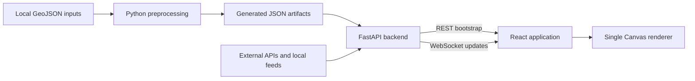

# Mini Singapore Developer Guide

This document is the technical handoff for Mini Singapore. It explains how data becomes pixels, how the live application is structured, and how to extend the system without coupling a new feature to the rest of the renderer.

For installation and everyday use, start with [README.md](README.md).

## 1. Product Intent

Mini Singapore is an ambient, pixel-art view of a living island.

- It prioritizes visual rhythm, atmosphere, and legibility over geographic precision.
- It combines a locally preprocessed Singapore map with live or simulated activity.
- It is not a navigation, safety, dispatch, or official traffic-monitoring tool.
- Vehicles snap to pixel routes by design.
- Weather and event effects may be smoothed, accelerated, or stylized.
- Source modes and simulations are global to the running server, not personal to each browser.

Preserve these constraints when adding features. A technically accurate layer that dominates the scene or turns the dashboard into an operations console is usually the wrong product choice.

## 2. System Overview

The application has three main stages:



- **Preprocessing**
  - Converts large GeoJSON files into normalized and rasterized map artifacts.
  - Builds road topology, road pixels, rail pixels, land-use sectors, greenery, and airport paths.
  - Runs only when geographic source data or rasterization rules change.

- **Backend**
  - Loads generated artifacts into memory at startup.
  - Owns live and simulated data-source state.
  - Maps geographic events to roads.
  - Polls external providers.
  - Sends static bootstrap data over REST and changing state over WebSocket.

- **Frontend**
  - Holds a normalized client state in a reducer.
  - Renders all visual features into one HTML canvas.
  - Separates immutable preparation from per-frame drawing.
  - Keeps dashboard controls and ambient storytelling outside the map renderer.

The application is modular, but it is not a plug-in runtime. Adding a source or layer still requires explicit registration at the preprocessing, backend, frontend contract, and compositor boundaries described below.

## 3. Repository Map

```text
TrafficMap/
├── backend/
│   ├── app.py                    FastAPI app, schedulers, WebSocket protocol
│   ├── road_state.py             Road incidents and static network payload
│   ├── city_data.py              Dynamic-source facade and mode ownership
│   ├── buses.py                  Bus metadata, arrivals, and journeys
│   ├── settings.py               Minimal root .env loader
│   ├── clients/                  Shared blocking HTTP helpers
│   ├── layers/                   Dynamic source parsers and simulations
│   └── routing/                  Spatial index, mapping, road graph, and A*
├── config/
│   └── dashboard.json            Rendering, timing, source, and API settings
├── data/
│   ├── map.geojson               Roads
│   ├── mrtlines.geojson          MRT and LRT lines
│   ├── mrtstations.geojson       MRT and LRT stations
│   ├── greenery.geojson          Green areas
│   ├── airports.geojson          Airport geometry
│   ├── landuse.geojson           Land-use polygons
│   └── TrafficIncidents.json     Local incident feed
├── frontend/
│   ├── src/
│   │   ├── App.tsx               UI composition
│   │   ├── api.ts                REST and WebSocket transport
│   │   ├── types.ts              Browser-side payload contracts
│   │   ├── components/           Canvas shell and dashboard UI
│   │   ├── features/             Realtime state, modes, and story moments
│   │   └── map/                  Layer, interaction, geometry, and motion code
│   └── tests/                    Pure TypeScript characterization tests
├── output/                       Generated runtime JSON; previews are ignored
├── preprocess/
│   ├── pipeline.py               Preprocessing entry point
│   ├── load_network.py           Road filtering and loading
│   ├── simplify.py               Geometry simplification
│   ├── graph_builder.py          Road topology
│   ├── map_layout.py             Stylized normalized layout
│   ├── rasterize.py              Ordered road cells
│   ├── rail.py                   Rail overlay
│   ├── environmental.py          Static environment facade
│   └── environment_layers/       Land use, greenery, and airports
├── tests/                        Python unit and integration checks
├── .gitattributes               Git LFS rules for large data artifacts
├── .env.example                  Credential template
├── Dockerfile                    Multi-stage production image
├── compose.yaml                  Single-container local deployment
├── README.md                     User onboarding
├── DEV_GUIDE.md                  This document
├── requirements.txt              Python dependencies
└── run_web.py                    Production-like local entry point
```

## 4. Prerequisites and Setup

### Supported tools

- Python 3.10 or newer.
- Node.js 20.19–20.x, or 22.12 or newer.
- npm with lockfile support.
- Git LFS for source GeoJSON and generated runtime JSON.
- A modern browser with Canvas 2D, `Path2D`, `ResizeObserver`, and WebSocket support.
- Docker Desktop with Compose for the container workflow.

### Install dependencies

Run from the repository root:

```powershell
git lfs install
git lfs pull

python -m venv .venv
.\.venv\Scripts\python.exe -m pip install -r requirements.txt

Set-Location frontend
npm.cmd ci
Set-Location ..
```

### Configure optional live sources

```powershell
Copy-Item .env.example .env
```

Supported server-side variables:

- `LTA_DATAMALL_ACCOUNT_KEY`
  - Enables live bus metadata and arrivals.
  - Enables higher-fidelity LTA roadworks and traffic-speed-band feeds.

- `DATA_GOV_SG_API_KEY`
  - Optional for rainfall and lightning.
  - Raises data.gov.sg rate limits.

- `VITE_API_BASE`
  - Frontend build-time setting, not a root backend secret.
  - Put it in `frontend/.env.local` or the shell when the frontend and API use different origins.
  - Omit the trailing slash.
  - Add the deployed frontend origin to `allow_origins` in `backend/app.py`; the current CORS list permits only the local Vite origins.

`backend/settings.py` reads simple `KEY=VALUE` lines from the root `.env`. Existing shell variables take precedence. It does not implement interpolation or full dotenv escape syntax. Restart the backend after changing credentials because provider objects capture keys during construction.

## 5. Running the Application

### Development

Backend, from the repository root:

```powershell
.\.venv\Scripts\python.exe -m uvicorn backend.app:app --reload
```

Frontend, from another terminal:

```powershell
Set-Location frontend
npm.cmd run dev
```

- Vite runs at `http://127.0.0.1:5173`.
- FastAPI runs at `http://127.0.0.1:8000`.
- Development transport defaults directly to port 8000.
- Vite also defines `/api` and `/ws` proxies for same-origin development code.

### Production-like local run

Build the frontend before starting FastAPI:

```powershell
Set-Location frontend
npm.cmd run build
Set-Location ..

.\.venv\Scripts\python.exe run_web.py
```

- FastAPI serves `frontend/dist`.
- The directory must exist when `backend.app` is imported.
- Restart FastAPI after rebuilding the frontend.
- Run exactly one Uvicorn worker. All engines, simulations, clients, clocks, and source modes are process-local.

### Docker

```powershell
Copy-Item .env.example .env
docker compose up --build -d
```

- The Node build stage produces `frontend/dist`.
- The Python runtime image includes only backend code, configuration, the local
  incident feed, generated JSON, and compiled frontend assets.
- Source GeoJSON, preprocessing code, tests, previews, caches, and secrets are
  excluded from the image.
- FastAPI listens on `0.0.0.0:8000`; Compose publishes the same host port.
- The health check calls `/api/health` after a 30-second startup allowance.
- Keep one container replica and one Uvicorn worker until mutable state and
  WebSocket broadcasting move to shared infrastructure.

### Working-directory rule

Start Python commands from the repository root. Core paths are relative, including:

- `output/*.json`
- `config/dashboard.json`
- `data/TrafficIncidents.json`
- `data/bus_network_cache.json`

Starting from another directory commonly causes import-time `FileNotFoundError`.

## 6. Geographic Preprocessing

### When to rebuild

Run preprocessing after changing:

- any source GeoJSON;
- supported road classes;
- simplification or topology rules;
- the map layout algorithm;
- raster resolution;
- rail matching;
- land-use, greenery, or airport extraction;
- a generated artifact schema.

Do not run it for ordinary frontend styling or live-provider changes.

### Command

```powershell
.\.venv\Scripts\python.exe -m preprocess.pipeline
```

Available options:

```text
--geojson
--output
--resolution {32,64,96,128,248,496,992}
--simplify-tolerance
--mrt-lines
--mrt-stations
--greenery
--airports
--land-use
```

Defaults:

- Roads: `data/map.geojson`
- Rail lines: `data/mrtlines.geojson`
- Rail stations: `data/mrtstations.geojson`
- Greenery: `data/greenery.geojson`
- Airports: `data/airports.geojson`
- Land use: `data/landuse.geojson`
- Output: `output/`
- Resolution: `992`
- Simplification tolerance: `0.00018`

Use a separate output directory and lower resolution for experiments. The production artifacts are large, and the pipeline overwrites named files without a transaction or rollback.

### Stage 1: load roads

`preprocess/load_network.py`:

- Accepts GeoJSON `LineString` features.
- Reads `properties.highway`.
- Includes:
  - motorway and motorway links;
  - trunk and trunk links;
  - primary and primary links;
  - secondary and secondary links;
  - tertiary and tertiary links;
  - residential;
  - living street;
  - service;
  - unclassified.
- Ignores unsupported classes and `MultiLineString` road features.
- Selects the road label from `ref`, then `name`, then the highway class.

### Stage 2: simplify geometry

`preprocess/simplify.py`:

- Applies Douglas–Peucker simplification.
- Retains source geometry for geographic matching.
- Samples geometry at approximately `0.00025` degrees for nearest-road lookup.

The simplification tolerance affects the simplified preview and road-derived island silhouette. Incident matching still samples original road geometry, and octilinear routing uses graph endpoints.

### Stage 3: build topology

`preprocess/graph_builder.py`:

- Creates one graph edge per accepted road feature.
- Merges near-coincident endpoints within `0.00012` degrees, approximately 13 metres.
- Classifies graph nodes as terminals, junctions, or interchanges using node degree.
- Assigns edge IDs from the current source-feature order for joins within that build.

The builder does not infer an intersection merely because two lines cross visually. Source features must terminate near one another to become connected.

Edge IDs are deterministic only while feature ordering is unchanged. Inserting or reordering source features can change IDs, so do not persist runtime references across preprocessing builds.

### Stage 4: create the map layout

`preprocess/map_layout.py`:

- Projects geographic coordinates into a normalized `0..1` world.
- Preserves Singapore's approximate `50:27` physical aspect ratio.
- Adds horizontal padding and vertically centers the island.
- Quantizes graph nodes.
- Routes edges horizontally, vertically, or diagonally at 45 degrees.
- Derives a 96-point island silhouette from the road extent.

The island silhouette is an aesthetic mask, not a surveyed coastline.

### Stage 5: rasterize roads

`preprocess/rasterize.py`:

- Converts normalized layout paths to integer cells with Bresenham rasterization.
- Preserves the order of pixels along every edge.
- Stores shared pixels where graph geometry overlaps.

Ordered pixels are required for:

- bus and traffic movement;
- incident and roadwork propagation;
- phase-based edge matching;
- topology-connected route building.

### Stage 6: build rail

`preprocess/rail.py`:

- Accepts rail `LineString` and `MultiLineString` features with a `ref`.
- Removes reciprocal duplicate route geometry.
- Produces one-pixel MRT and LRT paths.
- Associates station points with lines.
- Infers a nearby line when a station reference is missing.
- Stores line color and future-line state.

### Stage 7: build static environmental features

`preprocess/environmental.py` is the public facade. It delegates to focused modules under `preprocess/environment_layers/`:

- `common.py`
  - Shared polygon fill, boundary, line, and scanline helpers.

- `land_use.py`
  - Normalizes source properties into residential, commercial, industrial, civic, recreation, development, agriculture, military, water, and transport sectors.
  - Clips fills and outlines to the island.

- `greenery.py`
  - Fills supplied greenery polygons.

- `airports.py`
  - Extracts airport ground and terminal areas.
  - Builds taxiways, runways, runway lights, flight paths, and complete aircraft journeys.

Large areas are represented as scanline spans instead of individual cells to reduce JSON size.

### Stage 8: write artifacts and previews

The pipeline writes:

- `output/road_graph.json`
- `output/map_layout.json`
- `output/road_pixels.json`
- `output/rail_pixels.json`
- `output/environment_pixels.json`
- `output/network_raw.png`
- `output/network_simplified.png`
- `output/network_layout.png`
- `output/network_rail.png`
- `output/network_environment.png`

The five JSON artifacts are runtime inputs and use Git LFS. The PNG files are
diagnostic outputs: the pipeline regenerates them, Git ignores them, and Docker
does not include them.

Writes are not transactional. For a production update:

1. Generate into a separate directory.
2. Validate the complete artifact set.
3. Replace all related artifacts together.
4. Restart the backend.

Never mix files from different resolutions or pipeline runs.

## 7. Generated Artifact Contracts

Road, layout, raster, and rail artifacts currently use `schema_version: 1`;
`environment_pixels.json` uses version 2. Consumers do not validate every
version at runtime, so a version bump alone does not provide compatibility.
Coordinate producer, backend, frontend, and test changes explicitly.

### Coordinate conventions

- GeoJSON coordinate: `[longitude, latitude]`
- Incident API call: `(latitude, longitude)`
- Normalized world point: `[x, y]`, approximately `0..1`
- Raster cell: integer `[x, y]`, `0..resolution - 1`
- Scanline span: `[y, inclusive_start_x, inclusive_end_x]`
- Canvas rendering: normalized world coordinates after the camera transform

The frontend `Point` type is intentionally broad and is used for both normalized points and integer raster cells. Treat the owning field, not the TypeScript alias, as the source of truth.

### `road_graph.json`

- `nodes`
  - `id`
  - `longitude`
  - `latitude`
  - `degree`
  - `kind`

- `edges`
  - `id`
  - `road`
  - `highway_class`
  - `source_id`
  - `node_ids`
  - `geometry`
  - `simplified_geometry`
  - `sampled_coordinates`

This is the geographic and topological source for incident matching and routing.

### `map_layout.json`

- `bounds`: `[left, bottom, right, top]`
- `physical_aspect_ratio`
- normalized `land_polygon`
- normalized graph `nodes`
- stylized `edges` with ordered normalized `points`

This is the non-geographic visual layout.

### `road_pixels.json`

- `resolution`
- raster `land_polygon`
- `edges`
  - `edge_id`
  - `road`
  - `highway_class`
  - ordered integer `pixels`

Edge IDs must continue to match `road_graph.json` and `map_layout.json`.

### `rail_pixels.json`

- `resolution`
- `lines`
  - `ref`
  - `name`
  - `colour`
  - `future`
  - `route`
  - `pixels`
  - `paths`
- `stations`
  - `id`
  - `name`
  - `ref`
  - `lines`
  - `colours`
  - `pixel`
  - `lrt`
  - `matched`

### `environment_pixels.json`

- `resolution`
- `land_use.sectors`
  - `category`
  - `spans`
  - `outline_spans`
- `greenery_spans`
- `airports`
  - `ground_spans`
  - `terminal_spans`
  - `taxiway_pixels`
  - `runway_pixels`
  - `runway_light_pixels`
  - `runway_threshold_pixels`
  - `flight_paths`
  - `aircraft_journeys`
    - `path`
    - `taxi_end_index`
    - `runway_end_index`
  - `aerodromes`

### Critical invariants

- Preserve edge IDs across graph, layout, and raster artifacts.
- Keep each edge's pixel list ordered.
- Use one resolution for all raster artifacts.
- Use equivalent bounds, aspect correction, and padding for every feature.
- Keep GeoJSON longitude first.
- Convert explicitly between geographic, normalized, and raster coordinates.

Projection logic is currently duplicated between map layout, shared preprocessing helpers, and live city-data projection. Treat the projection convention as one contract even though it is not yet one implementation.

## 8. Backend Architecture

### Application lifecycle

`backend/app.py`:

- Loads the root `.env`.
- Constructs `RoadStateEngine` and `CityDataEngine` at module import.
- Creates the FastAPI application and in-memory WebSocket registry.
- Starts the road-state animation loop and city-data polling loop in the application lifespan.
- Configures local-development CORS, GZip, API routes, WebSocket routing, and optional SPA hosting.

Import-time construction means missing core artifacts prevent the app from starting. It also means tests importing `backend.app` use real project artifacts unless they patch dependencies first.

### `RoadStateEngine`

`backend/road_state.py` owns:

- required graph, layout, raster, and dashboard configuration;
- the local incident feed;
- nearest-road incident mapping;
- live, simulated, and off incident modes;
- incident durations and decay;
- same-road-class neighbor propagation;
- per-edge road-state deltas;
- dashboard statistics;
- the cached startup `/api/network` payload;
- 1,400 deterministic topology-connected routes for background traffic.

Required startup artifacts:

- `output/road_graph.json`
- `output/map_layout.json`
- `output/road_pixels.json`
- `config/dashboard.json`

- `output/rail_pixels.json`
- `output/environment_pixels.json`

All five generated JSON artifacts are required. Missing or malformed artifacts abort startup; the clean public-release contract does not load older filenames or schemas.

`data/TrafficIncidents.json` is loaded at startup and when incident mode changes back to live. It is not continuously polled.

### Incident model

The local incident file is expected to be an object with a `value` array:

```json
{
  "value": [
    {
      "Type": "Roadwork",
      "Latitude": 1.3909,
      "Longitude": 103.7654,
      "Message": "Roadworks on KJE before BKE Exit."
    }
  ]
}
```

A top-level array is not accepted by the current loader. Missing files are treated as no live incidents; malformed data can abort startup.

Default real-time lifetime profiles:

- Roadwork: 2–3 hours
- Crash or accident: 1–2 hours
- Breakdown: 20–45 minutes
- Obstacle: 10–25 minutes
- Heavy traffic: 5–15 minutes
- Unknown: 5–10 minutes

Behavior:

- Geographic coordinates are the positioning source of truth.
- Road names in messages are descriptive only.
- Intensity contributions add and cap at `animation.maximum_intensity`.
- Neighbor propagation stays on adjacent edges of the same road class.
- Changes below the road-state delta threshold are not broadcast.
- Expired or nearly zero states are removed.
- Simulated aging is accelerated by `simulation.decay_multiplier`.
- Global time control affects incident aging.

`animation.neighbour_radius` is currently configured but unused. Propagation depth is controlled by the implemented adjacency logic and strength.

### `CityDataEngine`

`backend/city_data.py` is the stable facade for dynamic city-data sources.

It owns:

- selected source modes and a mirror of the incident mode;
- current source payloads;
- API-call clocks;
- provider availability status;
- geographic projection into the visual world;
- bus metadata and journeys;
- shared road routing;
- live, simulated, and off transitions;
- the complete city-data snapshot.

It delegates feature logic to:

- `backend/layers/rainfall.py`
- `backend/layers/wind.py`
- `backend/layers/lightning.py`
- `backend/layers/roadworks.py`
- `backend/layers/traffic_speed_bands.py`
- `backend/buses.py`
- `backend/clients/http.py`
- `backend/routing/`

This facade preserves a stable interface, but sources are manually registered. There is no abstract provider registry or automatic module discovery.

`backend.app` routes incident-mode changes to `RoadStateEngine.set_incident_mode()` and then mirrors the selected mode and effective status through `CityDataEngine.set_incident_mode()`. `CityDataEngine` does not own operational incident state.

### Shared routing

`backend/routing/` contains:

- `models.py`
  - Routing records and immutable values.

- `road_network.py`
  - Indexes graph, layout, and raster edges.
  - Exposes road pixels through a read-only, zero-copy mapping.
  - Builds bidirectional graph links.
  - Skips self-loop edges.

- `road_router.py`
  - Runs A* between edge endpoints.
  - Caches successful and failed edge-pair paths.
  - Orients edge pixel lists consistently.
  - Produces raster or normalized routes.
  - Builds deterministic topology routes for background traffic.

Route cost uses geographic sampled-coordinate length. A* expansion is capped to prevent unbounded searches.

`RoadStateEngine` and `CityDataEngine` currently construct separate network indexes and route caches. Consolidating them is a possible optimization, but it requires careful lifecycle and test changes.

### Bus engine

`backend/buses.py` handles a more complex source than the small layer modules.

- Static data:
  - Bus stops
  - Bus routes
  - Bus services
  - Cached in `data/bus_network_cache.json`
  - Refreshed approximately every 24 hours

- Live data:
  - Samples route-referenced stops.
  - Rotates through the sample instead of querying every stop at once.
  - Reads up to three upcoming buses per service.
  - Uses observed position and ETA.
  - Builds a road-bound route through the shared router.
  - Estimates speed from routed distance and ETA.
  - Retains observations briefly beyond ETA to avoid abrupt disappearance.

- Simulated data:
  - Uses cached route subsequences where available.
  - Weights route selection using published service frequency.
  - Falls back to a random road edge when metadata is unavailable.

A bus payload with `road_pixels: true` contains normalized pixel-center coordinates, not integer raster coordinates. The flag means that the route is already road-aligned and rasterized.

### External HTTP

`backend/clients/http.py`:

- Uses the standard library `urllib`.
- Sends `x-api-key` for data.gov.sg.
- Sends `AccountKey` for LTA where requested.
- Uses a finite timeout.
- Is called through `asyncio.to_thread` so blocking I/O does not block the event loop.
- Accepts query parameters for paginated and stop-specific LTA requests, so bus
  and city-data providers share one request implementation.

## 9. Source Modes and Polling

Every selectable source supports a subset of:

- `live`
  - Use the configured API or local feed.

- `simulated`
  - Produce aesthetic synthetic activity.

- `off`
  - Return or display the source's empty state.

The transport contract keeps three concepts separate:

- `source_modes`: the user's selected `live`, `simulated`, or `off` mode;
- `source_status`: the effective `live`, `simulated`, `loading`, `off`, or `inactive` state;
- payload provenance: record-level `simulated` flags or payload-level `source` values.

A failed live request keeps `source_modes[source]` set to `live`, changes `source_status[source]` to `simulated`, and returns simulated provenance. Never infer one field from another.

Exact source identifiers used by configuration, Python, WebSocket commands, and TypeScript are:

- `incidents`
- `buses`
- `rainfall`
- `lightning`
- `roadworks`
- `traffic_speed_bands`

Do not introduce a different display-oriented alias into transport payloads. Human-readable labels belong in `frontend/src/features/sources/sourceDefinitions.ts`.

Current behavior:

| Feature | Live source | Simulated behavior | Default poll |
|---|---|---|---:|
| Incidents | Local `data/TrafficIncidents.json` | Weighted random road incidents | Not polled |
| Buses | LTA DataMall arrivals and cached topology | Route-based bus journeys | 20 s |
| Rainfall/clouds | data.gov.sg rainfall stations | Stateful synthetic rainfall readings | 60 s |
| Wind | data.gov.sg direction and speed stations | Simulated calm vector | 300 s |
| Lightning | data.gov.sg lightning records | Random timed strikes | 180 s live; 9–22 s simulated |
| Roadworks | LTA DataMall | Generated road-matched works | 24 h |
| Background traffic | LTA Traffic Speed Bands v4 | Uniform fictional road traffic | 300 s |

Traffic Speed Bands v4 is much larger than the earlier feed and returns 500 rows
per page. `CityDataEngine.refresh_traffic_speed_bands()` therefore samples
evenly spaced pages instead of crawling the entire dataset. The defaults are 24
pages, a 5,000-row stride, and six concurrent requests. Configure these with
`traffic_speed_bands_sample_pages`, `traffic_speed_bands_sample_stride`, and
`traffic_speed_bands_parallel_requests`. The payload reports both
`records_received` and `matched_edges`; these values appear in the boot console.

Configured startup modes:

- `incidents`: `live`
- `buses`: `live`
- `rainfall`: `live`
- `lightning`: `live`
- `roadworks`: `live`
- `traffic_speed_bands`: `live`

Additional simulated visuals without provider toggles:

- MRT and LRT trains
- Aircraft
- Land-use lights
- Runway lights

The API debug panel receives clocks in this shape:

```json
{
  "interval_seconds": 60,
  "last_called_at": "2026-07-30T12:00:00+00:00",
  "active": true
}
```

- `active` is true only in live mode. Wind clocks are active only when rainfall is selected as live.
- The browser derives remaining time from the interval and last-call timestamp.
- Source-mode changes are not persisted to configuration.
- All connected clients share one mode state.

### Poll scheduler

`backend.app.city_data_loop` wakes once per second:

- Finds due providers.
- Starts due refreshes concurrently.
- Awaits and broadcasts their results.
- Builds at most one full city-data snapshot per due batch.
- Otherwise sends layer deltas plus one clock and one source-status update.
- Generates simulated lightning when due.
- Evolves simulated rainfall on its configured schedule.
- Skips API work for off sources and non-live sources that do not need periodic evolution.

The scheduler is explicit and source-specific. Adding a provider requires wiring its interval, due-key, refresh task, result event, and clock state.

Changing a source to live triggers an immediate refresh. The scheduler's separate due timestamp is not reset, so another scheduled refresh may occur soon afterward.

### Provider failure semantics

Failed live bus, rainfall, lightning, roadworks, speed-band, and wind refreshes
use simulated fallback while retaining live mode for the next scheduled retry.
Explicit simulated and off modes do not poll their live providers.

There is no structured provider error payload, exponential backoff, or persistent logging. A refresh method is expected to catch provider failures. An unexpected exception escaping into the outer scheduler can terminate that scheduler task.

### Source-specific mapping

- **Rainfall**
  - Projects in-bounds stations.
  - Simulated cells evolve from previous state to avoid teleportation.
  - The current renderer does not use station positions as local coverage.
  - Island-wide `maximum_mm` controls the darkness of procedural clouds.
  - Rain is not drawn as a separate rain-streak or radar layer.

- **Wind**
  - Joins NEA station metadata and readings by `stationId`.
  - Computes a speed-weighted circular mean direction and mean speed in knots.
  - Converts meteorological “from” direction into a normalized screen-motion vector.
  - Uses the stable simulated calm vector on provider failure.

- **Lightning**
  - Reads recent provider records.
  - Filters to the visual bounds.
  - Deduplicates live strikes.
  - Retains a small recent snapshot.
  - Simulated strikes choose visual-world locations.

- **Roadworks**
  - LTA records do not provide usable coordinates.
  - Exact normalized road names select candidate graph edges.
  - Repeated same-road events rotate over matching edges.
  - Unmatched road names are dropped.
  - Without an LTA key, simulated road-matched works remain visible.

- **Speed bands**
  - Geographic midpoint finds a nearby graph edge.
  - Road-name checks reject suspicious distant mismatches.
  - The slowest band wins when multiple records map to one edge.
  - The frontend converts lower speed into slower, denser background traffic.
  - Without an LTA key, background traffic uses its neutral simulated density.

## 10. Backend Transport Contracts

The server uses plain dictionaries rather than detailed Pydantic response models. The matching browser definitions live in `frontend/src/types.ts` and `frontend/src/api.ts`. Update both sides whenever a payload changes.

### REST

- `GET /api/health`
  - Returns basic process and WebSocket-client health.
  - Does not validate provider readiness.

- `GET /api/network`
  - Returns the cached static network payload.
  - Includes road layers, interactive major edges, rail, static environmental data, and background-traffic routes.
  - Individual edge records are limited to motorway, trunk, primary, secondary, and their link classes; lower classes remain in compact class-level pixel layers.
  - Current hover indexing narrows those records to non-link motorway, trunk, and primary roads.
  - Does not change until backend restart.

- `GET /api/state`
  - Returns road state, incidents, statistics, and dashboard configuration.
  - Includes the complete city-data state under `city_data`.

- `GET /api/city-data`
  - Returns the complete city-data snapshot.

- `WS /ws`
  - Sends a full `state_snapshot` immediately after connection.
  - Carries later deltas, source payloads, controls, and latency pings.

### Server-to-browser WebSocket events

- `state_snapshot`
- `road_state_update`
- `new_incident`
- `incident_expired`
- `bus_update`
- `rainfall_update`
- `lightning_batch`
- `lightning_event`
- `roadworks_update`
- `city_data_update`
- `api_clocks_update`
- `source_status_update`
- `statistics_update`
- `config_update`
- `pong`

Speed-band and wind batches use a complete `city_data_update`, not dedicated
delta events. `source_status_update` is a lightweight provider-state delta used
by the startup console and runtime diagnostics.

### Browser-to-server WebSocket commands

Ping:

```json
{
  "type": "ping",
  "payload": {"client_time": 12345}
}
```

Source mode:

```json
{
  "type": "source_mode",
  "payload": {
    "source": "buses",
    "mode": "simulated"
  }
}
```

Incident simulation configuration:

```json
{
  "type": "simulation_config",
  "payload": {
    "spawn_interval": 10,
    "decay_multiplier": 900,
    "maximum_incidents": 18
  }
}
```

Time control:

```json
{
  "type": "time_control",
  "payload": {
    "paused": false,
    "speed": 1
  }
}
```

Time-control speed is clamped to `0.1..20`. Controls mutate global in-memory state and reset on restart. There is no authentication, per-client isolation, persistence, or runtime message-schema validation.

Unknown generic commands are currently ignored by `RoadStateEngine` but still cause a `config_update` broadcast. Invalid source or mode values are not converted into a structured client error.

## 11. Frontend Architecture

### Entry and application shell

- `frontend/src/main.tsx`
  - Mounts React in `StrictMode`.
  - Loads the global stylesheet.

- `frontend/src/App.tsx`
  - Owns UI-only state.
  - Calls `useRealtimeState()` for backend state.
  - Composes the canvas, controls, legend, event monitor, and statistics.
  - Creates camera focus targets from selected story moments.

Development `StrictMode` may execute effects and expensive memo initializers twice. Production does not.

### Transport

`frontend/src/api.ts`:

- Loads `/api/network` and `/api/state` in parallel.
- Reports independent waiting, loading, ready, and failed bootstrap stages.
- Opens the WebSocket after bootstrap.
- Reconnects approximately 1.5 seconds after an unplanned close.
- Uses `VITE_API_BASE` when provided.
- Selects `ws://` or `wss://` from the page origin in same-origin production.

Messages sent while the socket is disconnected are silently dropped. A source-mode button can remain pending if its command is dropped before a confirming `source_modes` payload returns.

### State lifecycle

`frontend/src/hooks/useRealtimeState.ts`:

- Owns the reducer and socket.
- Owns progressive core and live-channel boot status.
- Sends a latency ping every three seconds.
- Prunes expired lightning animation data every 500 ms.
- Exposes state and a send helper.

`frontend/src/components/dashboard/BootScreen.tsx` renders the contained
"Waking Singapore" diagnostics. It treats provider failure as non-fatal,
distinguishes live, simulated, and off states, and reads layer counts from the
real bootstrap payload. `App.tsx` closes it after all active sources settle, or
after a 14-second safety timeout once core data is available.

`frontend/src/features/realtime/realtimeReducer.ts` holds:

- static network;
- indexed road-state values;
- incidents;
- statistics;
- dashboard configuration;
- city-data state;
- connection status;
- latency;
- bootstrap errors.

`frontend/src/features/realtime/cityDataAdapters.ts` contains immutable feature-specific update functions.

Important contract:

- Granular events update one city-data feature.
- `city_data_update` replaces the complete city-data object; it is not merged.
- A granular event received before city-data bootstrap is ignored.

### Canvas lifecycle

`frontend/src/components/RoadCanvas.tsx` is the scene orchestrator.

- Uses one visible canvas.
- Uses one `requestAnimationFrame` loop for every map feature.
- Caps rendering at 30 FPS.
- Caps device pixel ratio at 1.5.
- Disables image smoothing.
- Uses `ResizeObserver` for the viewport.
- Prepares static canvases and immutable models with `useMemo`.
- Stores frequent WebSocket values in `liveScene.current`.
- Keeps the animation effect independent from high-frequency React updates.
- Draws background and ambient specks before the map camera transform.
- Draws the tooltip and vignette above the canvas.

Do not create one canvas or animation loop per layer. The current architecture is intentionally a compositor, not a stack of React-rendered pixels.

## 12. Renderer Layer Contract

Layers expose preparation and drawing functions rather than React components.

```ts
interface LayerDrawCommand {
  id: LayerId;
  draw(context: CanvasRenderingContext2D): void;
}
```

`frontend/src/map/layers/compositor.ts`:

- Sorts commands by canonical z-index.
- Wraps each draw in `context.save()` and `context.restore()`.
- Prevents alpha, shadow, clipping, and transform leakage.

Canonical order in `frontend/src/map/layers/order.ts`:

| Z | Layer | Responsibility |
|---:|---|---|
| 10 | `baseMap` | Island, land use, greenery, airports, roads |
| 15 | `landUseOverlay` | Optional translucent sector colours |
| 20 | `sectorLights` | Night-time land-use activity |
| 21 | `runwayLights` | Animated airport lighting |
| 30 | `backgroundTraffic` | Ambient road vehicles |
| 35 | `roadworks` | Road-bound work events |
| 36 | `incidents` | Active road intensity |
| 40 | `buses` | Live or simulated buses |
| 50 | `railInfrastructure` | MRT/LRT lines and stations |
| 55 | `trains` | Simulated rail vehicles |
| 60 | `aircraft` | Simulated airport journeys |
| 70 | `lightning` | Short-lived strikes |
| 80 | `clouds` | Rainfall-driven or simulated cloud cover |

The compositor applies this order regardless of insertion order in `RoadCanvas`.

### Static layers

- `static/MainMapLayer.ts`
  - Prepares separate day and night offscreen canvases.
  - Draws the island mass, land-use fills, greenery, airport infrastructure, road outlines, and road classes.
  - Draws minor roads before major roads.
  - Exposes the island `Path2D` for clipping.

- `static/LandUseOverlayLayer.ts`
  - Prepares toggleable sector outlines.
  - Clips them to the island.

- `static/RailInfrastructureLayer.ts`
  - Prepares one-pixel MRT and LRT paths, dark outlines, and stations.
  - Handles future-line opacity and LRT distinction.

### Dynamic environmental layers

- `dynamic/LandUseLightsLayer.ts`
  - Deterministically chooses off-road sector lights.
  - Uses Singapore time and category behavior.
  - Randomizes residential on/off schedules around the evening and morning transition.

- `dynamic/RunwayLightsLayer.ts`
  - Animates edge and threshold lights.
  - Reduces visibility during daylight.

- `dynamic/RoadworksLayer.ts`
  - Rebuilds an offscreen cache only when its payload changes.
  - Spreads over neighboring cells from the matched road edge.
  - Groups falloff levels into shared paths.

- `dynamic/IncidentLayer.ts`
  - Renders road-state intensity rather than the incident list.
  - Spreads visually along the ordered cells of each affected edge.
  - Receives adjacent-edge propagation already calculated by `RoadStateEngine`.
  - Fades by alpha without cycling hue over time.

- `dynamic/LightningLayer.ts`
  - Draws a short purple expanding pixel burst.
  - Uses the client receipt clock for animation.

- `dynamic/CloudLayer.ts`
  - Prepares deterministic organic cloud variants.
  - Morphs and moves them on the pixel grid.
  - Uses island-wide `rainfall.maximum_mm` to blend every procedural cloud toward darker rain palettes.
  - Does not position cloud coverage from rainfall-station coordinates.
  - Does not draw when rainfall mode is off.
  - Integrates position frame by frame, eases toward new five-minute wind vectors, and re-enters only after leaving the visible world.

### Dynamic vehicle layers

- `dynamic/vehicles/BackgroundTrafficLayer.ts`
  - Creates multiple visual vehicles for each preprocessed traffic route.
  - Uses speed bands to vary density and speed.
  - Keeps movement on supplied road pixels.
  - Uses its own route-index timing rather than the shared timed-motion function.

- `dynamic/vehicles/BusLayer.ts`
  - Converts normalized routes into contiguous normalized pixel centers when needed.
  - Computes progress from ISO start time and journey duration.
  - Colors vehicles by load.

- `dynamic/vehicles/AircraftLayer.ts`
  - Derives arrivals and departures from each airport area's runway and taxiway pixels.
  - Splits combined airport runway pixels into connected components so a flight never jumps between parallel runways.
  - Animates taxi, runway acceleration, flight, and idle phases.
  - Uses shared heading calculations.

### Dynamic rail

- `dynamic/rail/TrainLayer.ts`
- `dynamic/rail/trainKinematics.ts`

Behavior:

- Chooses the longest usable path for each current line.
- Matches stations to route indices.
- Runs up to two trains from opposite termini.
- Uses acceleration and deceleration.
- Uses approximately 85 km/h for MRT and 30 km/h for LRT.
- Dwells at stations for 30 seconds.
- Disappears into and emerges from a station pixel by pixel.
- Restarts the simulation epoch when the canvas mounts.

### Shared motion

`frontend/src/map/vehicles/motion.ts` provides:

- `routeProgress()` for `once`, `loop`, and `reverse` behavior;
- `timedVehicleProgress()` for timestamped journeys;
- `routePosition()` for discrete pixel movement;
- `routeHeading()` for multi-cell vehicle direction.

Buses and aircraft use parts of this shared system. Background traffic currently uses separate timing logic.

`timedVehicleProgress()` defaults live journeys to one-way `once` motion and simulated journeys to `reverse`. Pass an explicit policy when a simulated vehicle should loop in one direction.

## 13. Camera, Hover, and Dashboard

### Camera

`frontend/src/map/interaction/` owns:

- world-to-screen and screen-to-world transforms;
- cursor-anchored exponential wheel zoom;
- drag panning in CSS pixels;
- double-click reset;
- animated focus on an event;
- zoom clamping from dashboard configuration.

Base scale uses the smaller viewport dimension and the configured camera zoom. Preprocessed geometry already includes the physical aspect correction.

### Hover priority

Hit testing checks, in order:

1. incidents;
2. roadworks;
3. buses;
4. MRT/LRT stations;
5. non-link motorway, trunk, and primary roads.

Hover data is stored in refs so high-frequency payload changes do not rebind pointer listeners.

### Source controls

`frontend/src/features/sources/sourceDefinitions.ts` is the display registry for:

- source labels;
- source-mode cycling;
- API-clock labels.

The UI cycles one button through `live`, `simulated`, and `off`. Sources without a real provider should declare and use an explicit capability rather than expose a nonfunctional live state.

### Story moments

`frontend/src/features/moments/`:

- Converts incidents, roadworks, buses, rainfall, lightning, rail, aircraft, and congestion into a shared ambient story model.
- Separates factual event information from short flavor text.
- Selects a random candidate on a fixed interval.
- Keeps the current moment stable while underlying feeds update.

The current shared model is shaped like an incident even for non-incident events. Treat that as a compatibility shortcut, not the ideal domain model.

The current selection interval is 20 seconds. Selecting the event card starts a 900 ms camera tween and focuses to at least 3.6× zoom, subject to the configured maximum.

## 14. Time and Animation Conventions

Use the correct clock for the behavior:

- `Date.now()`
  - Wall-clock source timestamps.
  - Live vehicle movement.
  - Singapore day/night transitions.

- `performance.now()`
  - Browser-local animation elapsed time.
  - Lightning receipt and expiry.

- Canvas mount epoch
  - Deterministic train simulation.

- Server monotonic loop time
  - Poll scheduling and incident updates.

Backend-generated ISO timestamps use UTC. Upstream timestamps retain provider offsets and formats; for example, data.gov.sg may supply `+08:00`. Day/night behavior explicitly calculates Singapore UTC+8 in `frontend/src/map/core/time.ts`.

Avoid comparing `performance.now()` values with Unix or ISO timestamps.

## 15. Configuration

`config/dashboard.json` is the authoritative startup configuration.

Main groups:

- `simulation`
  - Incident simulation enabled state
  - Spawn interval
  - Decay multiplier
  - Maximum incidents
  - Per-road-class selection weights

- `rendering`
  - Background and island colors
  - Road hierarchy palette
  - Ping colors

- `animation`
  - Maximum road intensity
  - Neighbor propagation strength
  - Update frequency

- `camera`
  - Default, minimum, and maximum zoom

- `city_data`
  - Default source modes
  - API endpoints
  - Poll intervals
  - Bus sample and cache settings
  - Simulation counts and timing
  - Local fallback paths

Runtime WebSocket changes mutate memory only. They do not rewrite this file.

## 16. Extension Guide: Static Geographic Layer

Use this route for a new polygon, line, or point dataset that changes only when GeoJSON changes.

1. Add the source file under `data/`.
2. Document accepted geometry types and required properties.
3. Create `preprocess/environment_layers/<feature>.py`.
4. Accept parsed GeoJSON, the shared projector, and resolution.
5. Use:
   - scanline spans for large filled regions;
   - boundary spans for outlines;
   - ordered pixels for routes;
   - deterministic sorting for reproducible output.
6. Export the builder from `preprocess/environment_layers/__init__.py`.
7. Call it from `preprocess/environmental.py`.
8. Add the input parameter and CLI flag to `preprocess/pipeline.py`.
9. Include the result in `environment_pixels.json`, or create a dedicated artifact if the feature is large and independently versioned.
10. Add the feature to `network_environment.png`.
11. Extend `NetworkPayload` in `frontend/src/types.ts`.
12. Render it:
    - inside `MainMapLayer` when always part of the base map; or
    - as a new cached static layer when independently toggleable.
13. Add a layer ID and z-index if it is independent.
14. Add preprocessing, artifact, and layer-order tests.
15. Rebuild all artifacts and restart the backend.

## 17. Extension Guide: Dynamic Data Source

Define the transport contract before writing rendering code.

### Backend

1. Create `backend/layers/<source>.py`.
2. Keep parsing, projection, simulation, and empty-state construction deterministic and testable.
3. Inject configuration, projection, randomness, and fetched data where practical.
4. Export the layer from `backend/layers/__init__.py`.
5. Add endpoint, polling, simulation, and default-mode settings to `config/dashboard.json`.
6. Add credentials to `.env.example` if required.
7. Add state to `CityDataEngine`:
   - selected source mode;
   - current payload;
   - provider status;
   - API clock, if live and polled;
   - `refresh_<source>()`;
   - `set_source_mode()` dispatch;
   - complete snapshot field.
8. Add the source to `backend.app.city_data_loop`:
   - local due time;
   - interval;
   - live clock marking;
   - refresh task;
   - result broadcast.
9. Decide between:
   - a small granular event; or
   - a complete `city_data_update`.
10. Broadcast API-clock changes even when a successful provider result is an empty collection.
11. Apply the source's documented simulated fallback while retaining selected live mode for retry.

### Frontend

1. Add the exact payload to `frontend/src/types.ts`.
2. Extend `CityDataPayload`, `SourceMode`, `SourceStatus`, and provenance unions.
3. Add a WebSocket event to `frontend/src/api.ts` if using a delta.
4. Add an immutable adapter in `cityDataAdapters.ts`.
5. Add a reducer branch in `realtimeReducer.ts`.
6. Add source metadata and an API-clock label in `sourceDefinitions.ts`.
7. Build the visual layer against the normalized payload only.
8. Keep provider-specific parsing out of canvas code.
9. Add legend, hover, statistics, and story support only when they improve the ambient experience.
10. Test live, simulated, and off payloads independently.

### Contract rule

Live and simulated payloads must share one stable shape. Renderers may use `source_modes`, `source_status`, or record provenance only when the distinction intentionally changes visual or motion behavior.

### Simulated-only feature

For a purely decorative browser simulation:

- Keep it frontend-only when no shared server state, source data, or cross-client synchronization is needed.
- Prepare deterministic routes or sprites outside the frame loop.
- Add a compositor layer and optional local UI toggle.

For a simulated feature whose mode must be shared:

- Give it a normal city-data payload and backend-owned mode.
- Add a source capability flag so the control cycles only `simulated` and `off`.
- Do not invent a live provider or show a dead live state.

## 18. Extension Guide: Vehicle Layer

Use shared routing and motion where they fit, but keep feature-specific lifecycle rules in the feature module.

1. Decide the route space:
   - geographic input;
   - normalized world route;
   - ordered raster cells.
2. For road vehicles:
   - map source positions to road edges;
   - connect edges through `RoadRouter`;
   - send a route already aligned to road pixels.
3. Include stable timing fields:
   - start timestamp;
   - duration or speed;
   - lifecycle mode;
   - identity when continuity across refreshes matters.
4. Keep route construction on the backend when it depends on topology or external coordinates.
5. Use `frontend/src/map/vehicles/motion.ts` for time-to-progress, position, and heading.
6. Snap the final visual to raster cells.
7. Prepare static route data outside the animation frame.
8. Avoid allocating route copies per frame.
9. Add vehicle-specific phases only where required:
   - bus ETA and stops;
   - train dwell and station ingress;
   - aircraft taxi, acceleration, and flight.
10. Verify direction, continuity, route containment, refresh transitions, and disappearance.

## 19. Performance Rules

The 992 × 992 grid and large road network make small architectural mistakes expensive.

- Keep one visible canvas and one animation loop.
- Cache static map and rail imagery offscreen.
- Prepare payload-dependent paths only when that payload changes.
- Store frequently changing feed values in refs.
- Do not make every WebSocket update a new animation-effect dependency.
- Do not create one DOM element per pixel.
- Use scanline spans for filled regions.
- Group cells into shared `Path2D` buckets where possible.
- Do not allocate `Path2D`, canvas elements, or large arrays inside every frame.
- Keep all provider fetching outside renderer modules.
- Cap device pixel ratio and frame rate deliberately.
- Preserve the compositor's `save()` and `restore()` isolation.
- Expose individual road edges only where hover needs them.
- Use lower-resolution output for experimental preprocessing.
- Profile preparation separately from steady-state rendering.

Increasing raster resolution grows static-canvas memory and preparation work approximately with the square of the dimension.

## 20. Testing and Validation

### Python

```powershell
.\.venv\Scripts\python.exe -m unittest discover -s tests -v
```

The suite covers:

- preprocessing and artifact integrity;
- aspect ratio and octilinear layout;
- environment and airport construction;
- incident matching, decay, and propagation;
- provider parsing and modes;
- roadworks and speed-band matching;
- shared routing;
- bus route road containment;
- city-data clocks and source changes;
- web payloads and controls;
- settings loading.

Some tests expect the default 992-resolution artifacts. Rebuild the normal output before running the full suite when artifacts are absent or stale.

### Frontend

```powershell
Set-Location frontend
npm.cmd test
npm.cmd run lint
npm.cmd run build
```

- `npm test`
  - Compiles and runs dependency-free TypeScript characterization tests.

- `npm run lint`
  - Runs strict TypeScript checking.
  - It is not ESLint.

- `npm run build`
  - Validates the production React/Vite bundle.

Current frontend tests cover:

- road hierarchy;
- normalized route rasterization;
- road-bound propagation;
- vehicle motion;
- camera transforms;
- train kinematics;
- Singapore daylight;
- canonical layer ordering.

There is no browser automation, screenshot regression suite, code-coverage target, or CI configuration.

### Manual integration checks

With a running backend:

```powershell
.\.venv\Scripts\python.exe tests\integration_ws_check.py
```

Provider smoke helper:

```powershell
.\.venv\Scripts\python.exe tests\live_city_data_check.py
```

- The script loads the root `.env`.
- It refreshes sources that are live in the current configuration.
- It invokes bus, rainfall, wind, lightning, roadworks, and speed-band refresh methods.
- All selectable sources currently default to live, so this helper can make
  every configured external request and consume provider quota.
- Treat it as a targeted smoke helper, not comprehensive provider validation.

### Visual validation

After a geographic or renderer change:

- Compare all preprocessing preview PNGs.
- Check road, rail, land-use, greenery, and airport alignment.
- Verify live, simulated, and off for each changed source.
- Pan and zoom at minimum and maximum scale.
- Observe the scene for several minutes.
- Check dawn, day, dusk, and night behavior by controlled time tests.
- Confirm event focus and hover priorities.
- Inspect CPU and GPU use during idle, pan, zoom, and dense activity.

## 21. Deployment and Security

Current deployment assumptions:

- One Docker container, FastAPI process, and Uvicorn worker.
- Built frontend served from the same origin.
- Docker health checks `/api/health`; Compose restarts failed containers.
- TLS and public routing are supplied by an external reverse proxy.
- API keys remain on the server.

Build and start:

```powershell
docker compose up --build -d
docker compose ps
docker compose logs -f mini-singapore
```

The build context excludes source GeoJSON and previews. The runtime image uses
the already-generated `output/*.json`, so regenerate artifacts before building
when geographic inputs change. Do not bake `.env` into the image; Compose
injects it at runtime.

Before public exposure:

- Add authentication or remove mutable WebSocket controls.
- Restrict CORS to actual frontend origins.
- Add structured provider logs and health reporting.
- Add retry policy and scheduler supervision.
- Put shared state in external infrastructure before adding workers.
- Configure WebSocket support in the proxy.
- Add process management, restart policy, and monitoring.

The current `/api/health` confirms only that the process is alive and reports connected WebSocket clients. It is not a provider-readiness check.

## 22. Known Limitations and Technical Debt

- Backend engines are global import-time singletons rather than app-factory dependencies.
- The city-data scheduler manually wires every provider.
- WebSocket and REST payloads are not runtime schema-validated.
- Backend and frontend contracts must be synchronized manually.
- Invalid source commands are not safely reported to the client.
- Source modes, simulations, and controls are global and memory-only.
- Provider failures have limited visibility and no structured error payload.
- The outer city-data scheduler lacks robust supervision.
- WebSocket broadcasting is sequential across clients.
- Road-state and city-data engines duplicate road indexes and A* caches.
- The live incident file is loaded only at startup or mode re-entry.
- Roadworks without coordinates depend on exact normalized road names.
- Traffic Speed Bands uses a bounded, representative sample of the v4 LTA feed
  rather than every record. It is suitable for the ambient congestion effect,
  not transport analysis. If unavailable, background traffic uses neutral
  simulated density while live mode remains eligible for retry.
- Lightning deduplication state has no explicit size cap.
- `Point` does not encode coordinate space in TypeScript.
- Full `city_data_update` replacements bypass initial snapshot preparation and may contain lightning strikes without the client `received_at` animation stamp.
- `city_data_update` replaces the whole city-data object and can trigger unrelated recomputation.
- Background traffic does not use the common timed-vehicle engine.
- Story moments reuse an incident-shaped model for unrelated events.
- Commands sent during a WebSocket disconnect are dropped.
- The screen-space background, ambient specks, tooltip, and vignette sit outside the named layer stack.
- `physical_aspect_ratio` is transported but not read by the frontend camera.
- There is no CI, end-to-end browser testing, or visual regression testing.

Treat this list as a refactoring roadmap. Preserve current behavior with characterization tests before changing boundaries.

## 23. Troubleshooting

### Backend import fails with a missing output file

- Run the preprocessing pipeline.
- Confirm `road_graph.json`, `map_layout.json`, and `road_pixels.json`.
- Start the command from the repository root.

### API works but the production page is missing

- Build `frontend/dist`.
- Restart the backend after the build.

### Docker container runs but localhost is unreachable

- Confirm `docker compose ps` shows `0.0.0.0:8000->8000/tcp`.
- Start through Compose rather than Docker Desktop's image Run button unless
  port 8000 is explicitly published.
- Wait for health status; loading the generated JSON can take tens of seconds.
- Inspect `docker compose logs --tail=100 mini-singapore` for import or artifact
  failures.

### Overlays are shifted or misaligned

- Rebuild every artifact together.
- Confirm all raster artifacts share one resolution.
- Check longitude/latitude order.
- Check whether a `Point[]` is normalized or integer raster space.

### Vite cannot reach FastAPI

- Confirm FastAPI is listening on port 8000.
- Confirm Vite is listening on port 5173.
- Check `VITE_API_BASE` for an incorrect host or trailing slash.

### A live provider stays unavailable

- Confirm the correct root `.env` variable.
- Restart the backend.
- Check the API debug clocks.
- Confirm source mode is live.
- Confirm the provider endpoint and credentials are available.

### Background traffic is present but has no congestion variation

- Confirm speed bands are in live mode and mapped to edges.
- Without speed-band data, simulated mode intentionally uses uniform fictional traffic.

### Buses do not follow roads

- Inspect the bus route and `road_pixels` flag.
- Remember that `road_pixels: true` contains normalized cell centers.
- Verify graph connectivity between mapped stops.

### A new layer renders under or over the wrong feature

- Register it in `frontend/src/map/layers/order.ts`.
- Add it through the compositor.
- Update the canonical layer-order test.

### Zoom or pan becomes expensive

- Look for preparation happening inside the frame.
- Look for large React dependencies restarting the animation effect.
- Reuse offscreen canvases and grouped paths.
- Avoid per-frame route and pixel-array copies.

### Runtime controls reset

- This is expected. Modes and controls are not persisted.
- Change `config/dashboard.json` for a new startup default.

### Multiple workers show different worlds

- Use one worker.
- Move state, polling, and broadcasting to shared infrastructure before horizontal scaling.

## 24. Change Checklist

Before handing off a feature:

- Keep product behavior ambient and legible.
- Document the source, units, update interval, and failure behavior.
- Define coordinate space for every new point field.
- Define live, simulated, and off payloads with one stable shape.
- Add safe empty-state behavior.
- Keep preprocessing deterministic.
- Preserve stable edge and feature identities.
- Keep provider logic out of the renderer.
- Separate expensive preparation from frame drawing.
- Register layer order explicitly.
- Update Python and TypeScript contracts together.
- Add unit and characterization tests.
- Run Python tests, frontend tests, type checking, and production build.
- Test all source modes and provider failure.
- Inspect pan, zoom, idle animation, and long-running behavior.
- Update README only for user-visible setup or features.
- Update this guide for architecture, contracts, or extension-path changes.
